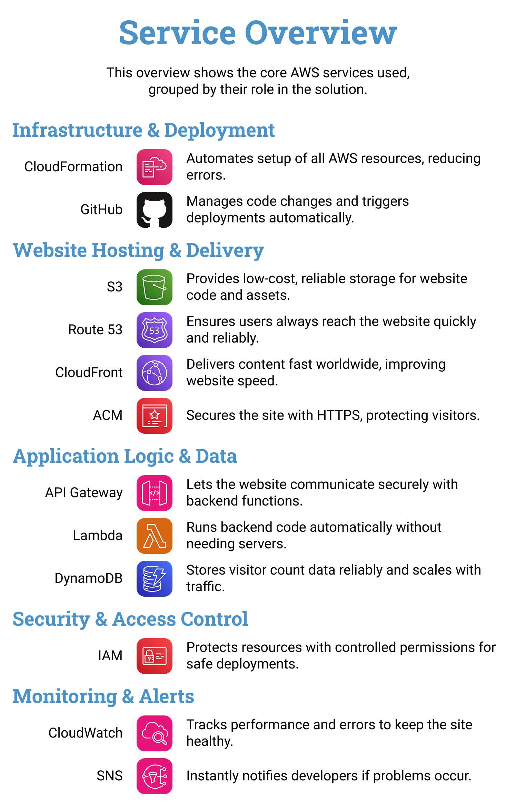

# Cloud Resume Challenge - Automated Website Deployment on AWS

A fully automated resume website deployed to AWS using GitHub Actions and CloudFormation.

---

## Project Overview

This project demonstrates how to build and deploy a personal resume website on AWS with full Infrastructure as Code (IaC) automation.  
It is designed to show both non-technical and technical viewers how cloud services can be combined into a working system.

- **Non-technical explanation**: This project takes my resume, stores it in the cloud, and makes it available on the internet through a secure, fast, and reliable website. It is automatically updated whenever I push changes to GitHub.  
- **Technical explanation**: The project uses AWS services such as S3, CloudFront, Route 53, API Gateway, Lambda, DynamoDB, and CloudWatch, all deployed via CloudFormation templates. GitHub Actions is used for CI/CD to automate deployments.

---

## Architecture Overview (Non-Technical)

- Website files stored safely in the cloud (S3)  
- Distributed quickly worldwide using a Content Delivery Network (CloudFront)  
- Secured with an SSL certificate (ACM)  
- Custom domain setup with DNS (Route 53)  
- Visitor counter powered by a small piece of code (Lambda + DynamoDB)  
- Automatic monitoring and email alerts (CloudWatch + SNS)  
- Updates triggered whenever code is pushed to GitHub (GitHub Actions)

---

## Detailed Flow (Technical)

1. Static assets and CloudFormation templates stored in S3  
2. GitHub Actions workflow triggers on push to `main`  
3. GitHub role assumes deployment permissions via IAM  
4. CloudFormation stacks create/update networking, backend, monitoring, and frontend resources  
5. API Gateway routes traffic to Lambda function for visitor counter  
6. Lambda reads/writes counter value in DynamoDB  
7. CloudWatch monitors metrics and sends alerts via SNS  
8. CloudFront serves website content securely to users via Route 53 domain

---

## Deployment Instructions

### Prerequisites
- AWS account with admin or equivalent privileges  
- Domain name registered in Route 53  
- GitHub repository (fork or clone this one)  
- Installed: AWS CLI, Git, and optionally `aws-vault` for credential management  

### Step 1: IAM Role and Policy
1. Create a new IAM policy using [`POLICY.md`](documentation/POLICY.md) as a base.  
2. Create an IAM role (e.g., `cloud-resume-github`) with **trust policy** allowing GitHub OIDC provider.  
3. Attach the IAM policy to this role.  

### Step 2: GitHub Setup
1. In GitHub repo → Settings → Actions → Secrets and Variables → Add:  
   - `AWS_ROLE_TO_ASSUME` = ARN of the IAM role you created  
   - `AWS_REGION` = e.g., `eu-west-2`  

### Step 3: Deployment
1. Push changes to the `main` branch  
2. GitHub Actions will automatically run and deploy CloudFormation stacks:  
   - Networking (CloudFront, Route 53, ACM)  
   - Backend (API Gateway, Lambda, DynamoDB)  
   - Monitoring (CloudWatch, SNS)  
   - Frontend (S3 website hosting)  

---

## IAM Policy Notes

For convenience, the included policy examples use **wildcards** in some places.  
Best practice is to replace these with specific ARNs after deployment once your resources exist and stabilize.  

- Example: Replace `"Resource": "*"` with `"Resource": "arn:aws:s3:::my-bucket-name/*"`  
- Use least privilege where possible, especially for IAM actions.  

---

## Testing the Website

1. Open your custom domain in the browser  
2. Confirm the website loads via HTTPS  
3. Refresh the page to see the visitor counter increment  
4. Check CloudWatch metrics to confirm requests and errors are being logged  
5. Trigger an error (optional) and confirm SNS email alerts arrive  

---

## Cleanup Instructions

To avoid unwanted AWS costs, delete resources after testing:

1. Delete CloudFormation stacks in reverse order:
   - Frontend
   - Monitoring
   - Backend
   - Networking  
2. Delete S3 buckets manually if they still contain files  
3. Unsubscribe from the SNS email topic  
4. Remove IAM role and policy created for GitHub Actions  
